# Giraffe Rover — Build Log

A Raspberry Pi Zero W controlled rover built on a modified **New Bright Power Horse** tracked toy chassis, with an **OWI-535 robotic arm** mounted on top, controlled via a browser-based web interface with live camera feed.

---

## Bill of Materials

| Part | Notes |
|------|-------|
| New Bright Power Horse tracked toy | Donor platform — chassis, tracks, two DC drive motors |
| OWI-535 Robotic Arm Edge (USB version) | 5-motor arm: elbow, wrist, grip + base rotation + LED |
| Raspberry Pi Zero W | Main controller — runs Python/Bottle server on port 8888 |
| RPi Camera Module | Live MJPEG feed embedded in web interface |
| USB hub | Connects OWI-535 and camera to the Pi's single USB port |
| LiPo / USB power bank | Powers Pi and arm |
| Jumper wire, heatshrink | Motor rewiring for independent left/right track control |

---

## Stage 1 — Donor Vehicle

The build starts with a **New Bright Power Horse** RC toy excavator. It provides the tracked base, two DC drive motors, and the chassis shell — all of which are repurposed for the rover.


The original toy uses a single motor driving both tracks together via a shared gearbox, with steering done by mechanically braking one side. For the rover, the two track motors need to be independently controllable so the RPi can drive them separately via bitmask commands — this requires rewiring.

---

## Stage 2 — Track Drive System

### Gearbox

The gearbox sits at the rear of the chassis under where the Raspberry Pi is later mounted. The lid comes off to expose the plastic gear train — two spur gear stacks transferring motor torque to the drive sprockets on each side.

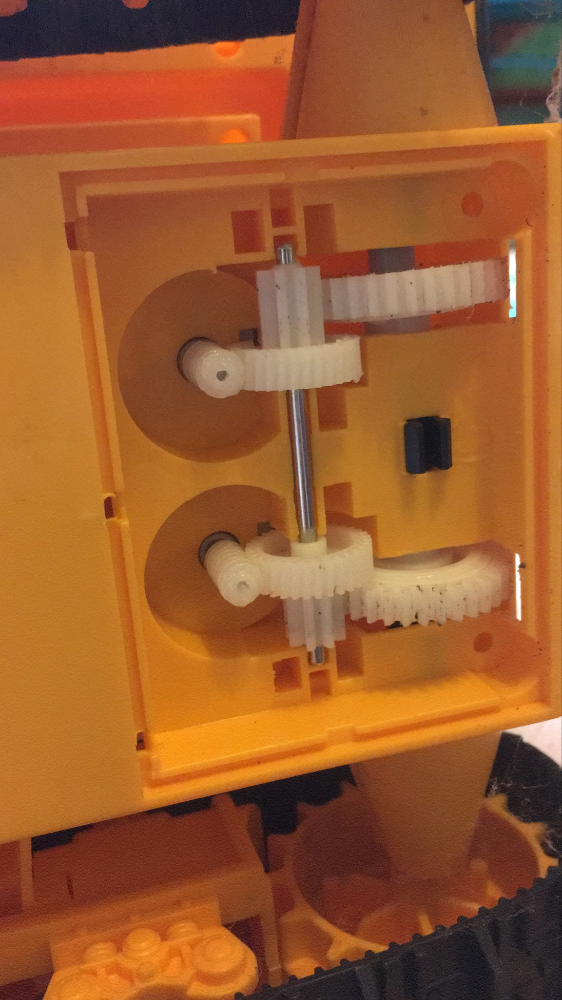

### Drive motors

Each track is driven by a small DC motor. After rewiring, each motor gets its own pair of leads (colour-coded) going directly to the RPi's USB/GPIO control path, allowing independent forward/reverse on each side — the basis for differential steering.


### Chassis — open top

With the cover removed you can see the internal motor mounting bays and the wire routing. The chassis shell provides natural channels to run cables up to the top deck where the electronics sit.

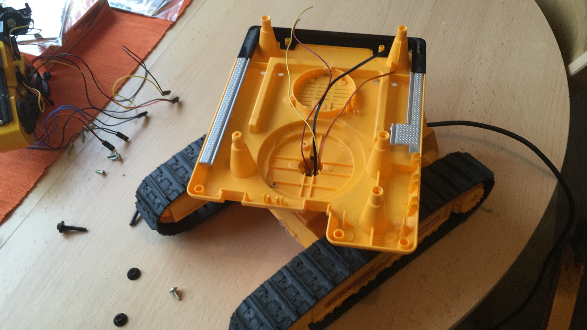

### Turntable mount

The top of the chassis has a large circular turntable ring — the arm's base rotation bearing mounts here, allowing the OWI-535 arm to pan left and right independently of the tracks.

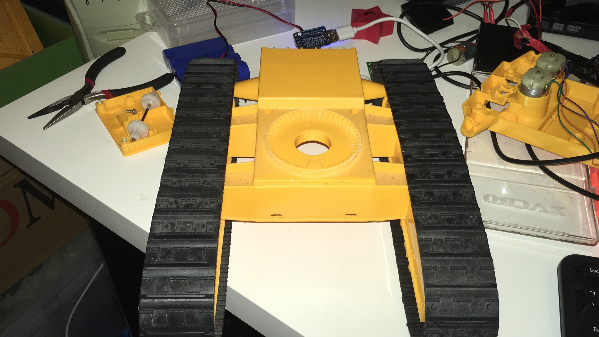

---

## Stage 3 — First Build Iteration

An early prototype was assembled over Christmas to validate the concept — arm on chassis, green RPi enclosure, WiFi antenna for wireless control.

### Workspace

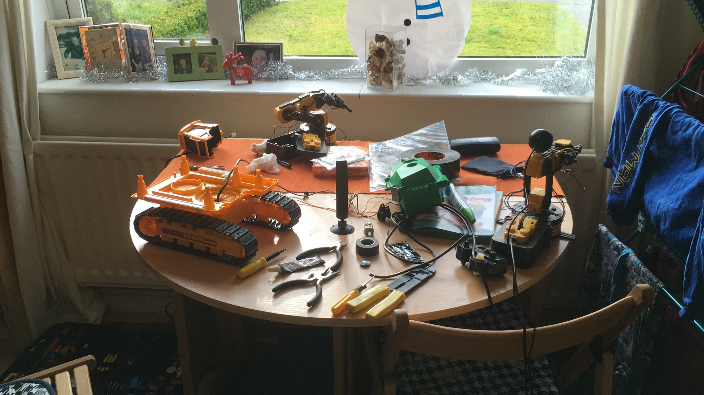

### Arm on chassis — early version

The OWI-535 arm is fitted to the tracked base. At this point the electronics are loosely placed — the focus is proving that the arm, tracks, and RPi can all talk to each other before finalising the packaging.

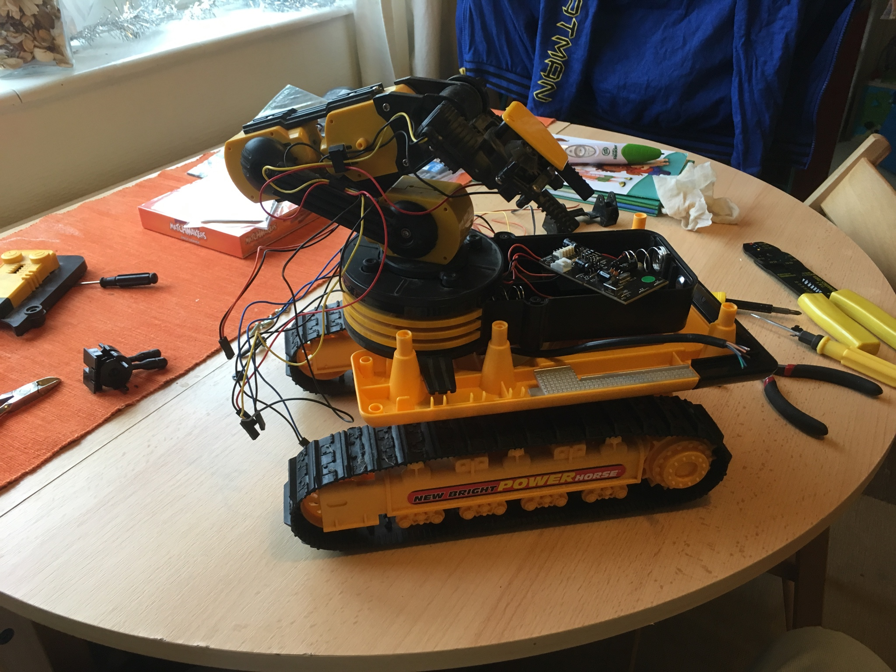

### RPi enclosure (prototype)

A green enclosure houses the Raspberry Pi with a WiFi antenna for reach. The size of the enclosure makes it bulky on the chassis — this is refined in the final version.

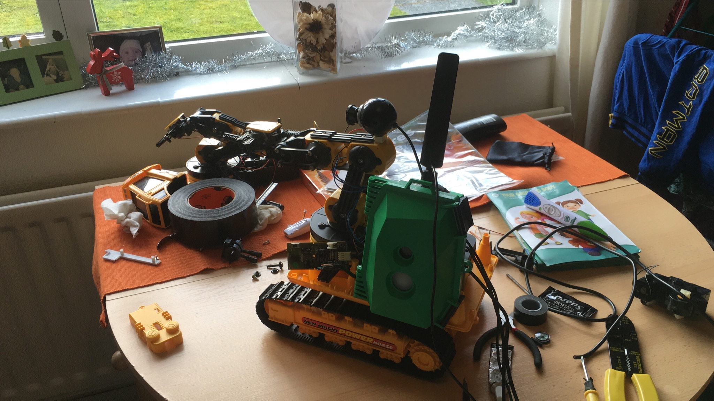

### Testing on carpet

First drive test with the prototype enclosure. The blue LEDs on the RPi power bank and the Pi itself confirm the system is live and connected.

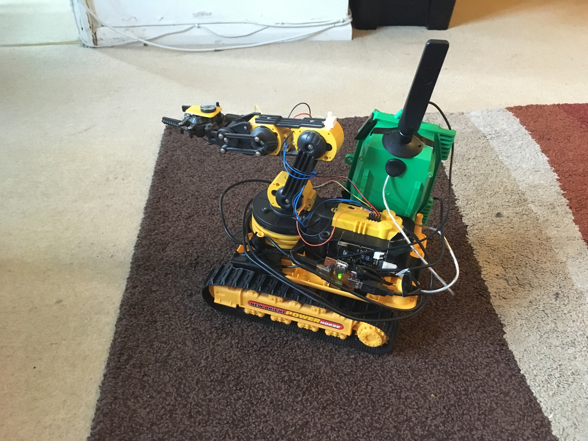

---

## Stage 4 — Arm Integration (Final Version)

With the concept validated, the build is refined. The arm base rotation motor is properly mounted to the turntable, and wiring is tidied up.

### Arm base motor fitting

The OWI-535 base rotation motor mounts to the turntable ring on the chassis deck. This motor is driven by the same USB control protocol as the rest of the arm — byte 0 bits control all five arm motors including base rotation.

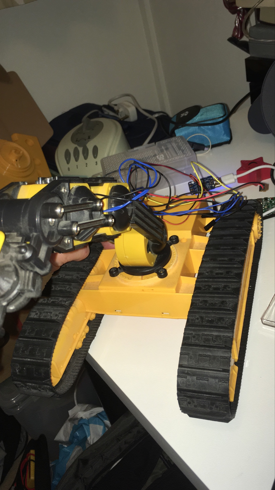


### Arm mounted on chassis

With the base motor in place the full OWI-535 arm is attached. The arm can now pan, extend, and grip independently of track movement — all controlled by single 3-byte USB writes.


### Cable routing through base joint

The arm's motor cables need to pass through the base rotation joint cleanly so they don't snag during pan movements.

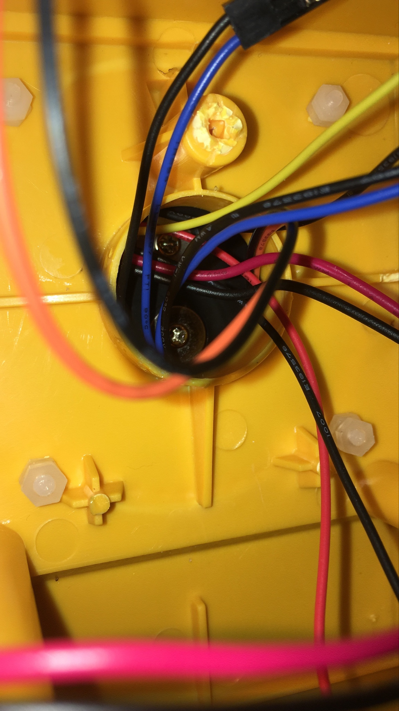

---

## Stage 5 — Electronics and Wiring

### Raspberry Pi Zero W

The Pi Zero W sits in the chassis bay above the rear gearbox — the green PCB visible with USB cables (white) going to the USB hub and down to the power bank, and the OWI-535 USB lead. The gearbox gear train is visible immediately below.


### Camera and RPi — top view

Without the arm fitted, the top deck shows the RPi Zero W and camera module mounted cleanly. The camera feeds a 640×480 MJPEG stream via `/stream` on the Bottle server.

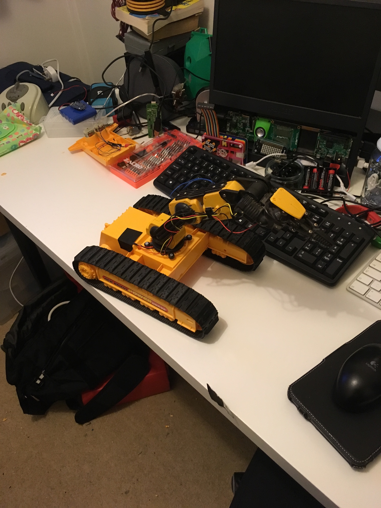

### USB connections — rear

The USB cable from the OWI-535 arm exits at the rear of the chassis. The red/black power leads for the track motors are also visible here.

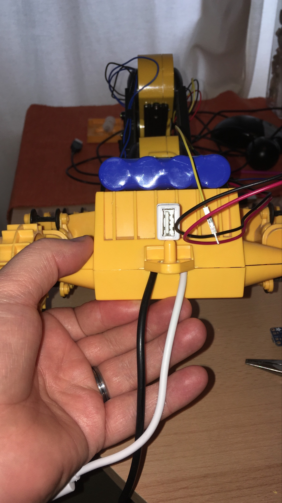

### Electronics close-up

The assembled electronics stack: USB hub, battery connections, motor leads, and control wiring all routing from the chassis interior up to the Pi.


---

## Stage 6 — Assembly and Testing

### Rover assembled

The finished rover with arm, chassis, blue LiPo battery pack (Velcro-mounted on top), and all wiring connected. A tethered USB cable provides power/data during bench testing before going wireless.

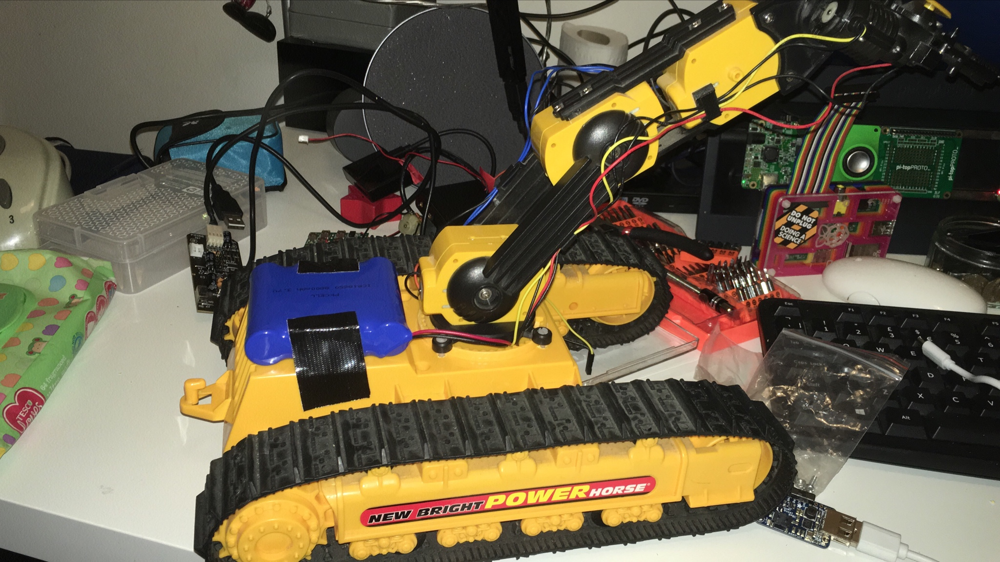

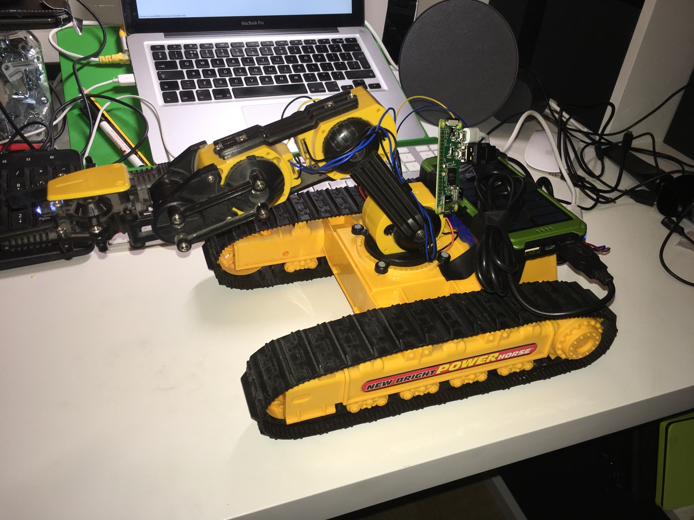

### First power-on

First live test of the complete system on carpet. Blue LEDs on the RPi and power bank confirm the Pi has booted; the camera LED indicates the stream is active. The white USB cable tethers it to a laptop for the initial software bring-up.

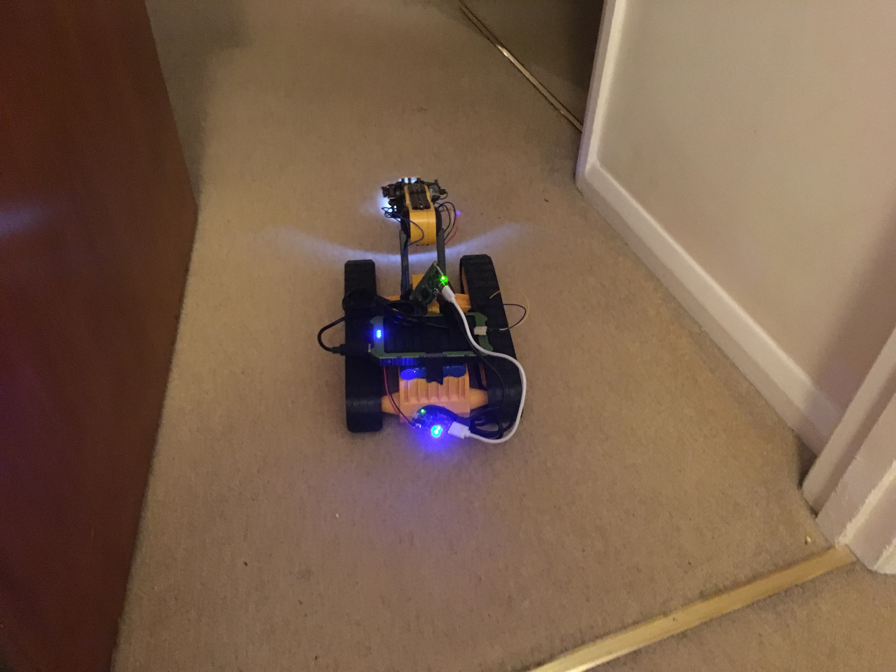

---

## Videos

Three video clips document the rover in motion:

| File | Description |
|------|-------------|
| [01-overview.mp4](images/01-overview.mp4) | Overview of the rover |
| [20-rover-driving.mp4](images/20-rover-driving.mp4) | Rover driving under web interface control |
| [24-final-demo.mp4](images/24-final-demo.mp4) | Final demo — tracks, arm, and camera all operating |

---

## Build Notes

### Track motor rewiring

The original New Bright toy drives both tracks from a single motor channel. To get independent left/right control the two motors must be rewired with separate leads. In the software these map to MOTORS[4] (right, byte 0 bits 6–7) and MOTORS[5] (left, byte 1 bits 0–1).

### USB initialisation

The OWI-535 uses vendor ID `0x1267`, product ID `0x0000`. Running the server with `sudo` is required for raw USB access without a udev rule. If the arm isn't found at startup the server logs `WARN: Reinitialising robocontroller` and retries on the next command.

### Simultaneous motor control

All five arm motors plus both track motors are packed into a single 3-byte command word. Each `GET /roboarm/component/feature/verb` request ANDs out the relevant bits and ORs in the new value — other motors are unaffected. This is what allows the arm to move while the rover is driving.

### Camera streaming

`/stream` is a `multipart/x-mixed-replace` MJPEG response. The frontend embeds it as a plain `` tag. The `waitress` WSGI server handles this on a dedicated thread so the long-lived stream connection never blocks motor command requests.

---

## Software Setup

See the main [README](../README.md) for full prerequisites and running instructions.

```bash
# On the Pi
sudo pip3 install -r requirements.txt
sudo apt install python3-picamera2   # Raspbian Bullseye+
sudo python3 giraffe-rover.py
```

Then open in a browser:

```
http://giraffe.local:8888/interface/index.html
```
